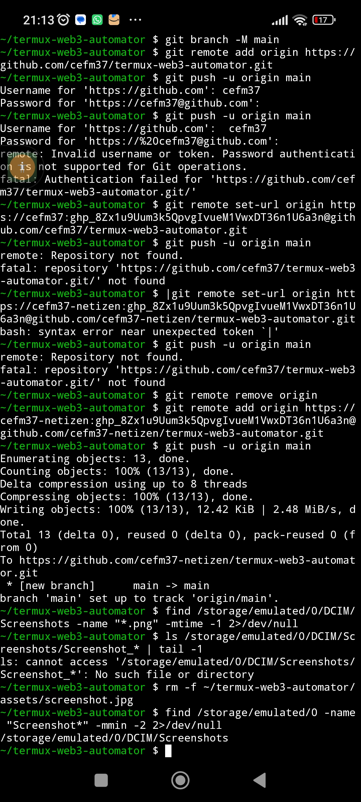

## 🛠️ Termux-Specific Installation

pkg install nodejs git -y
git clone https://github.com/cefm37-netizen/termux-web3-automator.git
cd termux-web3-automator
npm install
cp config.example.json config.json
# Edit config.json with your RPC URLs

## 🔒 Security Warning

This framework interacts with EVM networks. Never commit config.json or keys.json to public repositories. The .gitignore file is pre-configured to block these files. Use strong passwords for encrypted key files.

